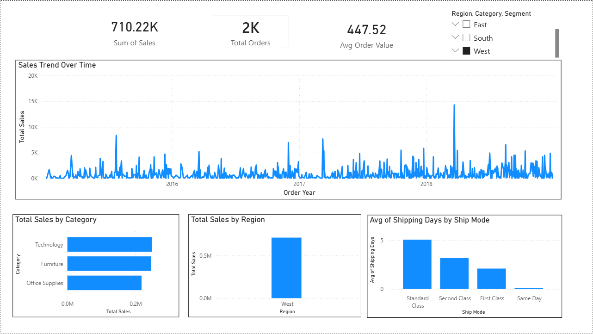

# 📊 Retail Sales Analytics Dashboard

## 📌 Overview
This project analyzes retail sales data to uncover insights in revenue, customer behavior, and shipping performance.

## 🛠 Tools Used
- Python (Pandas)
- Excel (Pivot Tables)
- Power BI (Dashboard)

## 📊 Key Features
- Data cleaning and preprocessing
- Feature engineering (Order Year, Month, Shipping Days)
- KPI metrics (Total Sales, Total Orders, Avg Order Value)
- Interactive dashboard with slicers

## 📈 Insights
- Top-performing product categories
- Regional sales trends
- Shipping performance analysis

## 🖼 Dashboard Preview

